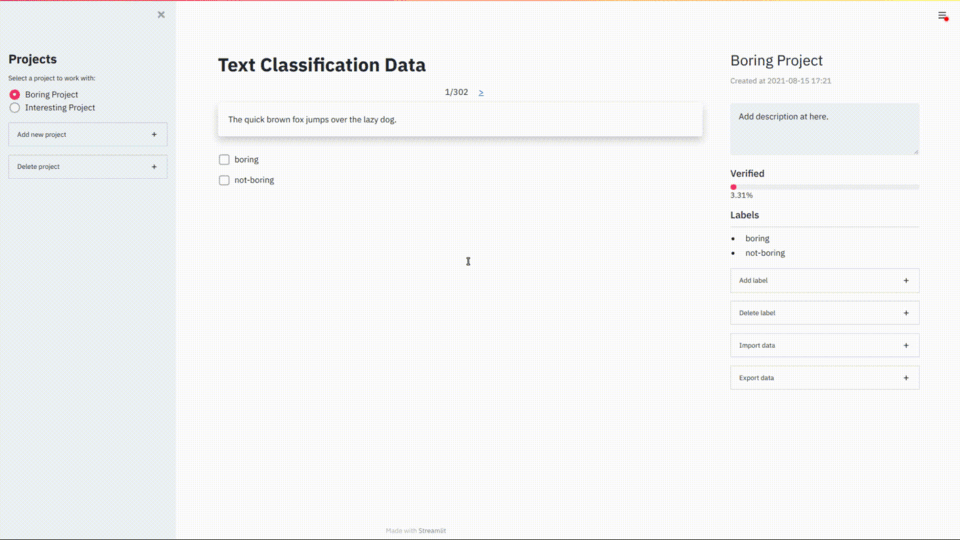

Data labelling tool using Streamlit. So far the app only support labelling of text classification data.


## Table of Contents
* [Prepare Environments](#prepare-environments)
* [REST API](#rest-api)
* [Streamlit App](#streamlit-app)


## Prepare Environments
The codes were tested and ran on Ubuntu 18.04 using python 3.7. 
Create and set up a python environment by running the following command in the terminal
```
# create python venv and install libraries in the requirements.txt
source ./create_env
```
Once the preparations are finished, start the app by running the two commands in separate terminals
```
# start REST API
source ./start_api

# start streamlit app
source ./start_streamlit_app
```

## REST API
Flask is chosen because of its simplicity and lightweight web framework. 
The [config file](config.yaml) contains all the api endpoint addresses being used. 
For simplicity, there is no database being used, all data are stored in csv files. 
Integration of database like SQLite might be done in the future.<br>
Start the server by running the command
```
source ./start_api
```

## Streamlit App
Streamlit is not a perfect tool but it is one of the simplest tool we can use to build a web app. 
Start Streamlit app by running
```
source ./start_streamlit_app
```
